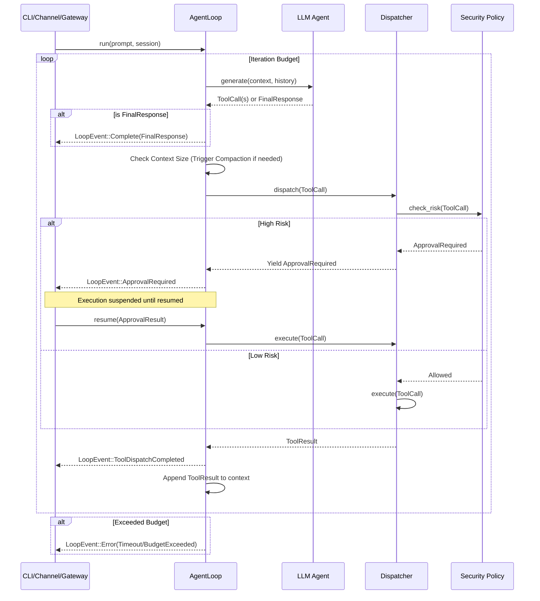

# Design: Unified Agent Loop

## Technical Approach

The core technical strategy is to deprecate the dual-loop architecture (`loop_.rs` and the internal
loop in `agent.rs`) and consolidate them into a single, canonical `AgentLoop` state machine. This
unified loop will be instantiated by all entry points (CLI, Channels, Gateway) to ensure consistent
lifecycle management, security invariant enforcement, and stream event emitting.

The `AgentLoop` will act as the primary orchestrator. It will rely on an `Agent` for interacting
with the LLM (yielding tool calls or text) and a `Dispatcher` for executing tools and enforcing risk
policies. The execution will be represented as an asynchronous `Stream` of `LoopEvent`s, allowing
consumers to handle streaming responses, tool progress, and approval interruptions idiomatically.

## Architecture Decisions

### Decision: Single Unified Loop Struct vs Entry-point Specific Traits

**Choice**: A single `AgentLoop` struct configured via a `LoopConfig`, containing an `Agent` and a
`Dispatcher`.
**Alternatives considered**: A generic `Loop` trait implemented differently by CLI, Channel, and
Gateway.
**Rationale**: To eliminate the current drift risk across surfaces, we need a single source of truth
for the loop lifecycle. Behavioral differences between entry points should be handled via
configuration (`LoopConfig`) rather than divergent loop implementations. This ensures security and
compaction invariants are universally applied.

### Decision: Stream Event Emitting

**Choice**: `AgentLoop::run` returns an async `Stream<Item = LoopEvent>`.
**Alternatives considered**: Passing a callback closure or a channel sender `mpsc::Sender` into the
loop.
**Rationale**: Returning a `Stream` is idiomatic in modern Rust (via `async-stream` or underlying
`mpsc` receivers). It provides a clean, pull-based API that allows callers to easily process events
concurrently, apply timeouts, or transform the stream into channel-specific formats (e.g., SSE for
the gateway, stdout for CLI).

### Decision: Security Invariant Enforcement Boundary

**Choice**: The `Dispatcher` is responsible for evaluating risk classifications and pausing for
approval, returning an `ApprovalRequired` state to the loop.
**Alternatives considered**: The `AgentLoop` evaluates risk before calling the `Dispatcher`.
**Rationale**: The `Dispatcher` has the deepest knowledge of the tools (their schemas, side effects,
and risk profiles). It is best positioned to evaluate risk policies. The loop simply orchestrates
the suspension of execution and emission of the `ApprovalRequired` event to the client, waiting for
a `resume` call.

## Data Flow



## File Changes

| File                                              | Action | Description                                                           |
|---------------------------------------------------|--------|-----------------------------------------------------------------------|
| `clients/agent-runtime/src/agent/loop_.rs`        | Delete | Remove the legacy active runtime loop.                                |
| `clients/agent-runtime/src/agent/unified_loop.rs` | Create | Define `AgentLoop`, `LoopEvent`, `LoopConfig`, and the state machine. |
| `clients/agent-runtime/src/agent/agent.rs`        | Modify | Remove internal loop logic; expose step-wise generation.              |
| `clients/agent-runtime/src/agent/dispatcher.rs`   | Modify | Integrate security policy enforcement and yield for approval.         |
| `clients/agent-runtime/src/main.rs`               | Modify | Update CLI entry point to instantiate and consume `AgentLoop`.        |
| `clients/agent-runtime/src/channels/mod.rs`       | Modify | Update channel runtime to map `LoopEvent`s to channel messages.       |
| `clients/agent-runtime/src/gateway/mod.rs`        | Modify | Update gateway webhook to use `AgentLoop` with strict session bounds. |

## Interfaces / Contracts

```rust
use futures::stream::Stream;
use std::sync::Arc;
use std::time::Duration;

pub struct LoopConfig {
    pub max_iterations: usize,
    pub timeout: Duration,
    pub compaction_threshold: usize,
}

pub enum LoopEvent {
    Start,
    LLMProgress(String),
    ToolDispatchStarted(ToolCall),
    ApprovalRequired(ApprovalRequest),
    ToolDispatchCompleted(ToolResult),
    CompactionTriggered,
    Complete(FinalResponse),
    Error(LoopError),
}

pub struct AgentLoop {
    agent: Arc<Agent>,
    dispatcher: Arc<Dispatcher>,
    config: LoopConfig,
    // Internal state tracking
}

impl AgentLoop {
    pub fn new(agent: Arc<Agent>, dispatcher: Arc<Dispatcher>, config: LoopConfig) -> Self {
        // ...
    }

    /// Starts the loop and returns a stream of events.
    pub fn run(&mut self, prompt: Prompt, session: Session) -> impl Stream<Item = LoopEvent> {
        // ...
    }

    /// Resumes the loop after an approval request.
    pub fn resume(&mut self, approval: ApprovalResult) -> impl Stream<Item = LoopEvent> {
        // ...
    }
}
```

## Testing Strategy

| Layer       | What to Test               | Approach                                                                                                           |
|-------------|----------------------------|--------------------------------------------------------------------------------------------------------------------|
| Unit        | `AgentLoop` state machine  | Mock `Agent` and `Dispatcher` to verify iteration limits, compaction triggers, and event emission.                 |
| Unit        | `Dispatcher` risk policies | Provide mock tools with varying risk levels to ensure `ApprovalRequired` is yielded correctly.                     |
| Integration | Loop execution flow        | Use a local/dummy model provider to run a full prompt -> tool -> response cycle without external IO.               |
| E2E         | Entry points (CLI/Gateway) | Verify that CLI output and Gateway SSE streams correctly reflect the underlying `LoopEvent`s, including approvals. |

## Migration / Rollout

This change will be rolled out in phases:

1. **Convergence**: Introduce `unified_loop.rs` alongside `loop_.rs`.
2. **Adapter Phase**: Update `main.rs` and `channels/mod.rs` to use `AgentLoop` behind a feature
   flag or configuration toggle to ensure parity.
3. **Hardening**: Verify compaction and timeouts behave as expected under load.
4. **Cleanup**: Remove `loop_.rs` and the old internal loop in `agent.rs`.

No data migration is required, as the loop runtime is stateless across sessions.

## Open Questions

- [ ] Does the gateway require any specific `LoopConfig` overrides (e.g., shorter timeouts) compared
  to the CLI?
- [ ] How should `AgentLoop` handle stream disconnects from the client side during a tool execution?
