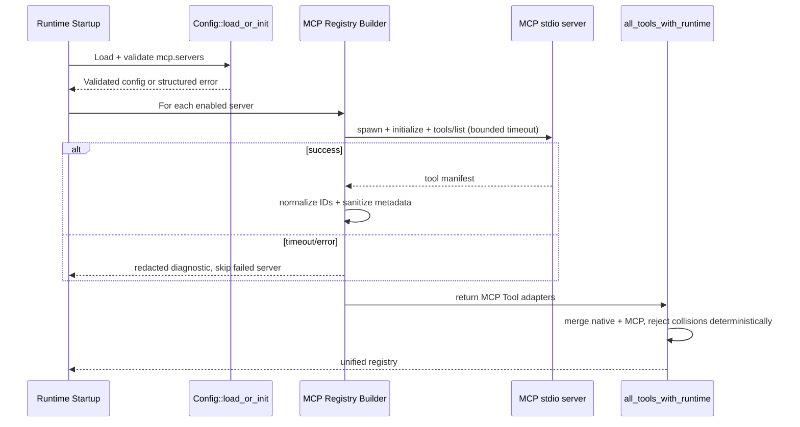
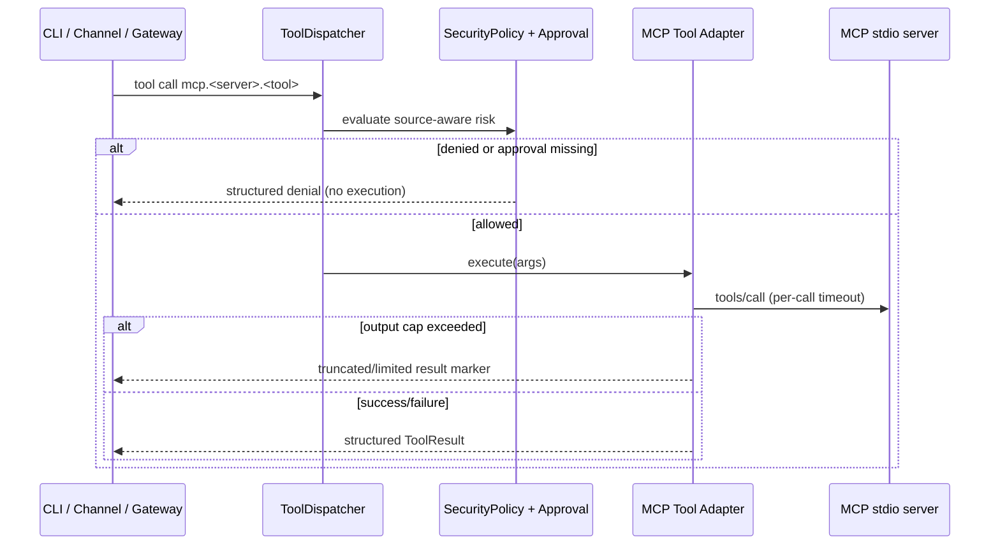

# Design: Support MCPs in Agent Runtime

## Technical Approach

This change adds a secure v1 MCP runtime path inside `clients/agent-runtime` by extending the
existing tool pipeline rather than creating a provider-specific integration. MCP servers are
configured in runtime config, discovered at startup, normalized into namespaced tools, and merged
into the same dispatch path used by native tools.

The design intentionally keeps v1 bounded to MCP tools over stdio transport and startup-time
discovery only. MCP resources/prompts, hot reload, and long-lived server orchestration are out of
scope.

Spec mapping: this approach directly satisfies all requirements in
`openspec/specs/mcp-runtime/spec.md` by placing config
validation, registration, policy/approval gating, and execution limits at the runtime/tool layer.

## V1 Boundaries

- In scope:
    - MCP `tools/list` discovery at startup from config-defined stdio servers.
    - MCP `tools/call` execution through the existing `Tool` trait surface.
    - Namespaced IDs (`mcp.<server>.<tool>`), collision rejection, risk/approval integration,
      timeout
      and output caps, redaction-safe diagnostics.
- Out of scope:
    - MCP resources/prompts.
    - Runtime hot reload of `mcp.servers`.
    - Persistent manifest cache across restarts.
    - Automatic reconnect/restart supervision beyond startup validation.

## Architecture Decisions

### Decision: MCP as Tool Adapter, Not Provider Feature

**Choice**: Add MCP support under `src/tools` as `Tool` adapters discovered during
`all_tools_with_runtime` construction.
**Alternatives considered**: Integrate MCP at provider layer; create separate MCP execution path.
**Rationale**: Existing architecture centralizes execution controls in tools + dispatcher. Keeping
MCP in this layer preserves uniform policy/approval behavior and minimizes risk of bypass.

### Decision: Startup Discovery + Immutable Runtime Manifest

**Choice**: Discover MCP tools once at startup and keep an in-memory manifest for runtime lifetime.
**Alternatives considered**: Per-request discovery; hot-reload watcher.
**Rationale**: Startup-only discovery is deterministic, easier to secure, and aligns with current
runtime lifecycle and v1 scope.

### Decision: Canonical Namespaced Identity

**Choice**: Canonical MCP tool identifier is `mcp.<server>.<tool>` with strict identifier
validation.
**Alternatives considered**: Flat tool names; provider-prefixed naming; dynamic aliasing.
**Rationale**: Prevents impersonation/collision, makes source explicit for policy and auditing, and
supports deterministic registry merge behavior.

### Decision: Fail-Closed Registration and Risk Gating

**Choice**: Reject invalid server definitions and ambiguous tool registrations at startup; require
policy/approval for MCP calls by default.
**Alternatives considered**: Best-effort registration with warnings; permissive defaults.
**Rationale**: Security-first model from project guardrails and spec requirement language (MUST
reject malformed/unsafe definitions; MUST deny or require approval without explicit allow).

### Decision: Shared Approval/Risk Engine Across Entry Points

**Choice**: Centralize MCP risk classification in dispatcher policy checks used by CLI, channels,
and gateway paths.
**Alternatives considered**: Per-entry-point checks.
**Rationale**: Prevents drift and satisfies entry-point parity requirement.

## Component Responsibilities

- `src/config/schema.rs`
    - Define `mcp` config model.
    - Validate server identity, command, timeout/limit bounds, and redaction-safe errors.
- `src/config/mod.rs`
    - Re-export MCP config types for compatibility.
- `src/tools/mcp/*` (new module)
    - MCP stdio client/session lifecycle.
    - Startup `tools/list` discovery.
    - `Tool` adapter implementation for each discovered MCP tool.
    - Invocation limits and output cap enforcement.
- `src/tools/traits.rs`
    - Extend `ToolSpec` metadata to carry source/origin needed for policy and audits.
- `src/tools/mod.rs`
    - Merge native + MCP tools in `all_tools_with_runtime` with deterministic collision checks.
- `src/agent/dispatcher.rs`
    - Classify MCP tool calls as risk-bearing by default.
    - Keep fail-closed unknown handling.
- `src/agent/agent.rs`
    - Consume unified registry and propagate structured denial/timeout outputs.
- `src/security/policy.rs`
    - Add MCP-aware policy evaluation primitives (source-aware allow/deny semantics).
- `src/approval/mod.rs`
    - Apply unknown/high-risk MCP approval requirement and structured denial format.
- `src/channels/mod.rs` and `src/gateway/mod.rs`
    - Ensure MCP tool invocations use the same dispatcher risk/approval decisions.

## Data / Config Model

```rust
// src/config/schema.rs (new)
#[derive(Debug, Clone, Serialize, Deserialize, Default)]
pub struct McpConfig {
    #[serde(default)]
    pub enabled: bool,
    #[serde(default)]
    pub servers: Vec<McpServerConfig>,
}

#[derive(Debug, Clone, Serialize, Deserialize)]
pub struct McpServerConfig {
    pub name: String,                     // canonical server id segment
    #[serde(default = "default_true")]
    pub enabled: bool,
    pub command: String,
    #[serde(default)]
    pub args: Vec<String>,
    #[serde(default)]
    pub env: std::collections::BTreeMap<String, String>, // supports env refs
    #[serde(default = "default_mcp_startup_timeout_ms")]
    pub startup_timeout_ms: u64,
    #[serde(default = "default_mcp_call_timeout_ms")]
    pub call_timeout_ms: u64,
    #[serde(default = "default_mcp_output_limit_bytes")]
    pub output_limit_bytes: usize,
}
```

Validation rules (load-time, fail-safe):

- `name`, `command` are required and must pass identifier/path safety checks.
- `startup_timeout_ms`, `call_timeout_ms`, `output_limit_bytes` MUST be positive.
- Reserved namespace fragments (`mcp`, invalid identifier chars) are rejected.
- Secret-like env values are allowed but never shown raw in diagnostics.

Tool metadata extension:

```rust
// src/tools/traits.rs (extension)
pub struct ToolSpec {
    pub name: String,
    pub description: String,
    pub parameters: serde_json::Value,
    pub source: Option<ToolSourceMetadata>,
}

pub struct ToolSourceMetadata {
    pub kind: String,            // "native" | "mcp"
    pub provider: Option<String>,// "mcp"
    pub server: Option<String>,
    pub original_name: Option<String>,
}
```

## Lifecycle / Flow

### Startup discovery and registration



### Invocation path with policy/approval



## Approval and Risk Model Integration

- MCP tools are classified as explicit risk-bearing operations by default.
- `check_tool_risk` remains fail-closed and is extended to treat `mcp.*` as
  `ApprovalRequired` unless explicit policy allows execution.
- Unknown/high-risk MCP actions route through approval semantics; if approval is not available or
  denied, return structured denial result and do not execute.
- CLI, channel, and gateway paths consume the same risk decision function to preserve parity.

## Security Model

- Trust boundary:
    - MCP servers are untrusted external processes.
    - Tool metadata and outputs are treated as untrusted input.
- Defenses:
    - Deny-by-default MCP execution without explicit allow/approval outcome.
    - Strict identifier normalization to prevent shadowing native tools.
    - Output and timeout ceilings to prevent hangs/resource abuse.
    - Sanitized, redacted diagnostics (no raw secrets/env dumps).
    - Capability scope: v1 registers only MCP tools; resources/prompts are ignored/rejected.

## Failure Modes and Handling

| Failure mode             | Behavior                                        | Safety guarantee               |
|--------------------------|-------------------------------------------------|--------------------------------|
| Invalid MCP config       | Startup fails with structured validation error  | No unsafe partial registration |
| One server fails startup | Server isolated and skipped; runtime continues  | Availability without bypass    |
| Discovery timeout        | Abort server discovery at timeout budget        | No indefinite startup block    |
| Name collision           | Deterministic startup error naming colliding ID | No ambiguous dispatch          |
| Invocation timeout       | Call aborted; structured timeout result         | Loop stability preserved       |
| Output overflow          | Truncate/fail per policy with explicit marker   | Memory/cost bounded            |
| Transport/server error   | Structured failure result returned              | No panic/deadlock              |

## Observability

- Reuse existing observer pipeline with additional MCP tags in tool names (`mcp.*`) so
  `ObserverEvent::ToolCall{tool,duration,success}` captures MCP behavior.
- Add redacted diagnostics on:
    - startup discovery success/failure per server,
    - collision rejection,
    - timeout/output-cap enforcement.
- Keep secrets out of logs by reusing redaction approach used by gateway/config debug surfaces.

## File Changes (clients/agent-runtime)

| File                                               | Action        | Description                                                                                             |
|----------------------------------------------------|---------------|---------------------------------------------------------------------------------------------------------|
| `clients/agent-runtime/src/config/schema.rs`       | Modify        | Add `mcp` schema types to `Config`; add load-time validation and redaction-safe error paths.            |
| `clients/agent-runtime/src/config/mod.rs`          | Modify        | Re-export MCP config types.                                                                             |
| `clients/agent-runtime/src/tools/mod.rs`           | Modify        | Build and merge MCP tool adapters in `all_tools_with_runtime`; enforce collision checks.                |
| `clients/agent-runtime/src/tools/traits.rs`        | Modify        | Extend `ToolSpec` with source metadata required for policy/audit decisions.                             |
| `clients/agent-runtime/src/tools/mcp/mod.rs`       | Create        | MCP module entrypoint and registry builder.                                                             |
| `clients/agent-runtime/src/tools/mcp/client.rs`    | Create        | Stdio MCP client session (`initialize`, `tools/list`, `tools/call`) with timeout controls.              |
| `clients/agent-runtime/src/tools/mcp/adapter.rs`   | Create        | `Tool` trait adapter wrapping discovered MCP tools.                                                     |
| `clients/agent-runtime/src/tools/mcp/normalize.rs` | Create        | Canonical naming, reserved namespace validation, metadata sanitization.                                 |
| `clients/agent-runtime/src/agent/dispatcher.rs`    | Modify        | Source-aware MCP risk classification and approval-required defaults.                                    |
| `clients/agent-runtime/src/agent/agent.rs`         | Modify        | Preserve structured MCP denial/timeout behavior in tool loop execution.                                 |
| `clients/agent-runtime/src/security/policy.rs`     | Modify        | Add MCP-specific policy helpers and defaults (deny unless explicit allow/approval).                     |
| `clients/agent-runtime/src/approval/mod.rs`        | Modify        | Integrate MCP unknown/high-risk handling into approval decision path.                                   |
| `clients/agent-runtime/src/channels/mod.rs`        | Modify        | Ensure channel tool loop applies same MCP risk/approval semantics.                                      |
| `clients/agent-runtime/src/gateway/mod.rs`         | Modify        | Ensure gateway MCP tool path (when tool-enabled) uses shared risk/approval checks; no bypass.           |
| `clients/agent-runtime/Cargo.toml`                 | Modify        | Add minimal MCP transport/protocol dependencies required for stdio v1.                                  |
| `clients/agent-runtime/tests/*`                    | Modify/Create | Add focused config, registration, policy, approval parity, timeout/cap, and failure isolation coverage. |

## Requirement Traceability

| Spec requirement                                | Design coverage                                                                                           |
|-------------------------------------------------|-----------------------------------------------------------------------------------------------------------|
| MCP Server Configuration Validation             | `Config` schema additions + load-time validation gates + redacted errors (`schema.rs`).                   |
| Startup Discovery and Registration              | Startup MCP registry builder with bounded server introspection and disabled-server skip.                  |
| Namespaced Tool Identity and Collision Handling | Canonical `mcp.<server>.<tool>` normalizer + deterministic collision rejection in registry merge.         |
| MCP Policy and Approval Enforcement             | Dispatcher fail-closed MCP classification + shared policy/approval checks across entry points.            |
| MCP Execution Limits and Timeouts               | Per-server startup timeout, per-call timeout, output-limit enforcement in MCP adapter/client.             |
| MCP Failure Handling and Safety                 | Per-server isolation on startup failures, structured invocation errors, reject non-tool MCP capabilities. |

## Testing Strategy

| Layer       | What to Test                       | Approach                                                                                                     |
|-------------|------------------------------------|--------------------------------------------------------------------------------------------------------------|
| Unit        | MCP config validation              | Table-driven tests for missing fields, invalid limits, reserved names, redaction in errors.                  |
| Unit        | Name normalization/collision logic | Deterministic canonicalization and rejection behavior for collisions and reserved IDs.                       |
| Unit        | MCP adapter limits                 | Timeout cancellation and output cap behavior using mocked stdio responses.                                   |
| Integration | Startup registry merge             | Native + MCP merge, disabled server skip, one-server-fails isolation.                                        |
| Integration | Risk/approval parity               | Equivalent MCP tool calls via agent loop, channel loop, and gateway path enforce same deny/approval outcome. |
| Regression  | Native tool invariants             | Existing native tool behavior and safe tool classification unchanged with MCP enabled.                       |

## Rollout Plan

1. Phase 1: Config + discovery scaffolding

- Add schema, validation, MCP client, startup discovery behind `mcp.enabled`.

2. Phase 2: Identity + dispatch + policy

- Introduce namespaced registration and centralized risk/approval handling.

3. Phase 3: Hardening

- Enforce timeouts/output caps, redaction diagnostics, and failure-isolation tests.

4. Verification gates

- Targeted unit/integration tests for all scenarios in spec delta.

Rollback:

- Set `mcp.enabled = false` (or remove `mcp.servers`) to revert to native-only tool registry.
- Keep policy engine unchanged; MCP path is additive and can be disabled without affecting native
  tool behavior.

## Open Questions

- [ ] Should v1 use only environment-variable secret references for MCP server env, or also allow
  encrypted inline values in `config.toml`?
- [ ] Should gateway switch fully to unified tool loop for tool-enabled webhook paths in this
  change, or gate MCP in gateway until that migration lands?
