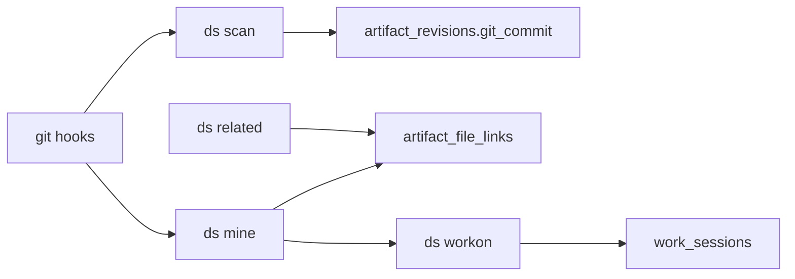

# Probabilistic related specs (80/20 slice)

Source spec: [testdata/samples/codex/PLAN.md](C:\Users\brenn\go\src\github.com\devspecs-com\devspecs-cli\testdata\samples\codex\PLAN.md). This plan maps it onto the current codebase ([internal/store](C:\Users\brenn\go\src\github.com\devspecs-com\devspecs-cli\internal\store), [internal/scan](C:\Users\brenn\go\src\github.com\devspecs-com\devspecs-cli\internal\scan), [internal/commands](C:\Users\brenn\go\src\github.com\devspecs-com\devspecs-cli\internal\commands), [internal/repo](C:\Users\brenn\go\src\github.com\devspecs-com\devspecs-cli\internal\repo)).

## Architecture (high level)

- **Evidence** is many rows per (artifact, file); **commands** aggregate with additive scores capped at 1.0 and map to high/medium/low buckets per PLAN.md (`>=0.75`, `>=0.45`, `>=0.20`; default `related` output hides low unless `--all`).
- **Work sessions** drive `workon_branch` evidence during `ds mine` when active.

## 1. Schema version 4

- Bump [internal/store/store.go](C:\Users\brenn\go\src\github.com\devspecs-com\devspecs-cli\internal\store\store.go) `SchemaVersion` to **4** (same rebuild gate pattern as v3).
- Extend [internal/store/schema.sql](C:\Users\brenn\go\src\github.com\devspecs-com\devspecs-cli\internal\store\schema.sql):

**`artifact_file_links`** (suggested columns aligned with PLAN):

- `artifact_id` (FK artifacts), `file_path` (normalized repo-relative, `/`-separated), `evidence_type` (TEXT), `evidence_value` (TEXT, human-readable / debug), `confidence` (REAL), `first_observed_at`, `last_observed_at`
- **Upsert key**: `UNIQUE(artifact_id, file_path, evidence_type, evidence_value)` so `INSERT ... ON CONFLICT ... DO UPDATE` can bump `last_observed_at` without duplicates (adjust if you prefer hashing long values).

**Indexes** (per PLAN):

- `file_path`, `artifact_id`, composite for repo+branch lookups if you store `repo_id` / `branch` on rows, **or** scope by joining `repos` / session state at query time. Minimal approach: add `repo_id TEXT` (nullable FK) and `branch TEXT` (nullable) on `artifact_file_links` only if queries need fast `(repo, branch)` filtering without joining artifacts every time; otherwise join `artifacts -> repos` in SQL.

**`work_sessions`**:

- `id`, `repo_root`, `worktree_root`, `branch`, `head_commit`, `artifact_id`, `started_at`, `ended_at` (NULL = active), or `active INTEGER` + unique partial index on `(repo_root, worktree_root, branch)` where active.
- `ds workon <id>` closes prior open row for same triple and inserts a new open row; `--clear` sets `ended_at` on the open row.

Update [internal/store/store_test.go](C:\Users\brenn\go\src\github.com\devspecs-com\devspecs-cli\internal\store\store_test.go) table list / version expectations.

## 2. Scan: fill `git_commit` on revisions

Today [internal/scan/scan.go](C:\Users\brenn\go\src\github.com\devspecs-com\devspecs-cli\internal\scan\scan.go) `insertRevision` omits `git_commit` even though [schema.sql](C:\Users\brenn\go\src\github.com\devspecs-com\devspecs-cli\internal\store\schema.sql) defines it.

- Pass `repo.HeadCommit(repoRoot)` into `insertRevision` (and any revision update path) so new rows set `git_commit`.
- Add a small store test or scan test asserting non-empty commit when run inside a git repo.

## 3. Store API ([internal/store/queries.go](C:\Users\brenn\go\src\github.com\devspecs-com\devspecs-cli\internal\store\queries.go))

- **`UpsertFileLink(...)`** — SQLite `ON CONFLICT` update `last_observed_at` (and optionally `confidence` if it changes).
- **`RelatedArtifactsForFile(repoRoot, normalizedPath, includeLow bool)`** — load all link rows for that file, **group by `artifact_id`**, sum `confidence` **additively** with **cap 1.0**, attach list of evidence rows for explainability, sort by score desc.
- **Workon**: `EndOpenSessions(repoRoot, worktreeRoot, branch)`, `StartWorkon(...)`, `GetActiveWorkon(...)`, `ClearWorkon(...)`.

Keep JSON shapes for `--json` stable (document field names in tests).

## 4. Mining engine (new package)

Add something like **`internal/mining`** (or `internal/relate`) to keep `commands` thin:

- **Path normalization**: repo-relative, forward slashes, consistent with existing sources paths (reuse patterns from [internal/adapters](C:\Users\brenn\go\src\github.com\devspecs-com\devspecs-cli\internal\adapters)).
- **Git signals** (extend [internal/repo/repo.go](C:\Users\brenn\go\src\github.com\devspecs-com\devspecs-cli\internal\repo\repo.go)): merge-base with default branch (`main`/`master` heuristic or `git symbolic-ref refs/remotes/origin/HEAD`), list changed files in commit range, read commit subjects/bodies for full IDs / short IDs (regex), pair **spec source paths** vs **code paths** in same commit for `same_commit` / `explicit_commit_ref`.
- **Text signals**: scan artifact body + todo text for substring match of file base name or normalized path (`spec_mentions_file`, `todo_mentions_file`, `same_directory` token heuristic).
- **Workon**: if active session artifact matches branch scope, emit `workon_branch` rows for files touched in the mined commit set.

Map evidence types and **confidence constants** exactly as in PLAN.md §Mining Behavior; implement **additive merge + cap** in one pure function for unit tests.

## 5. Commands

New files (pattern match [internal/commands/resume.go](C:\Users\brenn\go\src\github.com\devspecs-com\devspecs-cli\internal\commands\resume.go)):

| Command | Behavior |
|---------|----------|
| `ds workon <id>` | Resolve via `GetArtifact`, read `repo.Detect`, `HeadCommit`, worktree = repo root unless you later support linked worktrees via `git rev-parse --show-toplevel` + worktree path |
| `ds workon` | Print active session artifact / message if none |
| `ds workon --clear` | Clear per PLAN |
| `ds mine` | Default: current repo; `--recent` / `--all` scope; `--json` bucket counts; write links via store |
| `ds related <file>` | Resolve file to abs/rel, normalize, print high+medium (and low with `--all`), each artifact with **evidence lines**; `--json` |

Register in [cmd/ds/main.go](C:\Users\brenn\go\src\github.com\devspecs-com\devspecs-cli\cmd\ds\main.go).

Add **`--quiet`** to `mine` (and ensure hook lines use it) mirroring [internal/commands/scan.go](C:\Users\brenn\go\src\github.com\devspecs-com\devspecs-cli\internal\commands\scan.go).

## 6. Hooks

Refactor [internal/commands/init.go](C:\Users\brenn\go\src\github.com\devspecs-com\devspecs-cli\internal\commands\init.go):

- Generalize `hookMarker` / install logic to **multiple hook names**: `post-commit`, `post-checkout`, `post-merge`, `post-rewrite` with scripts per PLAN:
  - `post-commit`: `ds scan --quiet --if-changed && ds mine --recent --quiet`
  - `post-checkout`: `ds scan --quiet`
  - `post-merge` / `post-rewrite`: `ds scan --quiet && ds mine --recent --quiet`
- Preserve **idempotency** (marker-based append); extend [internal/commands/freshness_test.go](C:\Users\brenn\go\src\github.com\devspecs-com\devspecs-cli\internal\commands\freshness_test.go) (or `init_test`) to assert all hooks and double `init --hooks` behavior.

## 7. Testing (per PLAN.md §Tests)

- **Store**: version 4, DDL presence, upsert idempotency, related aggregation ranks multiple evidence rows into one artifact result.
- **Commands**: workon show/clear, mine `--recent --json` in temp git repo, related text + JSON.
- **Git fixtures**: scripted scenarios (same-commit spec+code, branch slug match, workon-linked files, spec mentions file, commit message mentions short/full id).
- **Regression**: `go test ./...`, golden JSON tests unchanged or updated intentionally with new fields only where applicable.

## 8. Documentation (optional but recommended)

- Update [README.md](C:\Users\brenn\go\src\github.com\devspecs-com\devspecs-cli\README.md) command tree and hook behavior when shipped.

## Risk notes

- **Performance**: uncapped history for `--all` should stay conservative (max commits / max files) to avoid minutes-long runs on huge repos.
- **Worktree path**: v1 can treat `worktree_root == repo_root`; document limitation or add `git rev-parse --show-prefix` only if needed.
- **False positives**: expected; copy is "likely related," not blame — keep evidence strings honest in CLI output.
