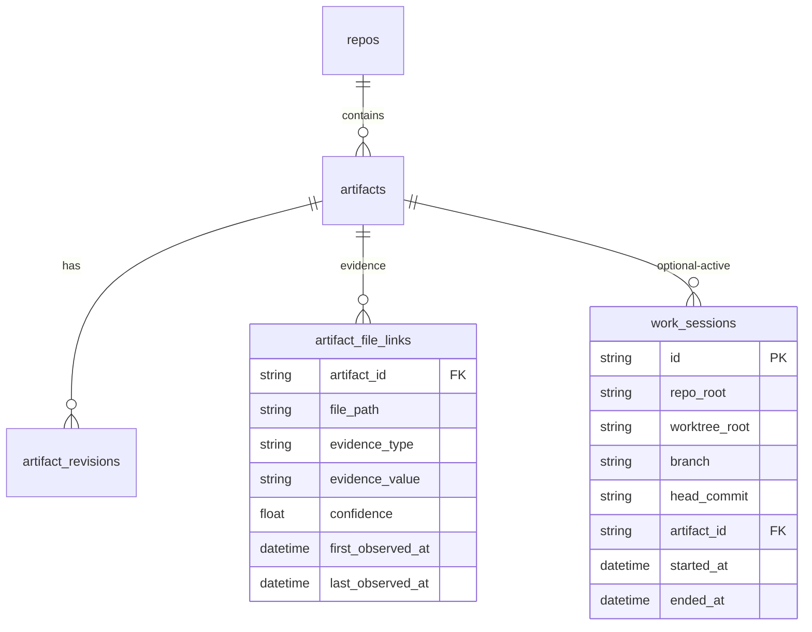

# Data model: Probabilistic related specs

**Feature**: [spec.md](./spec.md)  
**Schema version**: 4 (SQLite)

## Entity relationship (logical)

## Table: `artifact_file_links`

| Field | Type | Notes |
|-------|------|--------|
| `artifact_id` | TEXT FK → `artifacts` | Required |
| `file_path` | TEXT | Normalized repo-relative, `/` separators |
| `evidence_type` | TEXT | One of codex PLAN types (see [research.md](./research.md)) |
| `evidence_value` | TEXT | Human-readable / debug explanation |
| `confidence` | REAL | Per-row weight before aggregation |
| `first_observed_at` | TIMESTAMP | Set on insert |
| `last_observed_at` | TIMESTAMP | Bumped on upsert |

**Constraints**: `UNIQUE(artifact_id, file_path, evidence_type, evidence_value)` for **`INSERT ... ON CONFLICT DO UPDATE`** (update `last_observed_at`; optionally refresh `confidence`).

**Indexes**: At minimum on `file_path` and `artifact_id`. Add nullable `repo_id` / `branch` + composite index **only if** hot paths need filtering without joining through `artifacts` → `repos` (implementation choice documented in code review).

## Table: `work_sessions`

| Field | Type | Notes |
|-------|------|--------|
| `id` | TEXT PK | ULID/UUID per project conventions |
| `repo_root` | TEXT | Absolute or normalized root key |
| `worktree_root` | TEXT | v1 may equal `repo_root` |
| `branch` | TEXT | Current branch name |
| `head_commit` | TEXT | HEAD at `ds workon` time |
| `artifact_id` | TEXT FK | Active focus artifact |
| `started_at` | TIMESTAMP | Session open time |
| `ended_at` | TIMESTAMP | NULL = active |

**Rules**:

- At most **one active** session per `(repo_root, worktree_root, branch)` — enforce by ending prior open row before insert, or partial unique index on active rows (`ended_at IS NULL`).
- **`ds workon --clear`** sets `ended_at` on the open session for that triple.

## Revision metadata: `artifact_revisions.git_commit`

Populate on scan insert/update paths with current **`HeadCommit`** for `repo_root` so revision rows align with mined git history signals.

## Query behaviors

### `RelatedArtifactsForFile(repoRoot, filePathNormalized, includeLow)`

1. Load all link rows matching `file_path`.
2. **Group by `artifact_id`**.
3. **Sum `confidence`** additively, **cap aggregate at 1.0**.
4. Attach ordered list of contributing evidence rows (type, value, per-row confidence, timestamps).
5. **Sort** groups by aggregate score descending.
6. **Filter buckets**: default omit low unless `includeLow` or aggregate &lt; 0.20 excluded entirely from buckets.

### `UpsertFileLink`

Single-statement upsert keyed on uniqueness constraint; refresh `last_observed_at` (and `confidence` if policy allows updates).

## Validation rules (from spec)

- FR-003/FR-004 bucket and cap rules are enforced in **query/CLI layer** (store returns scores + evidence; commands map to high/medium/low for display).
- FR-012: mining over `--all` applies **hard caps** (max commits / max files) at mining layer before writing links.
